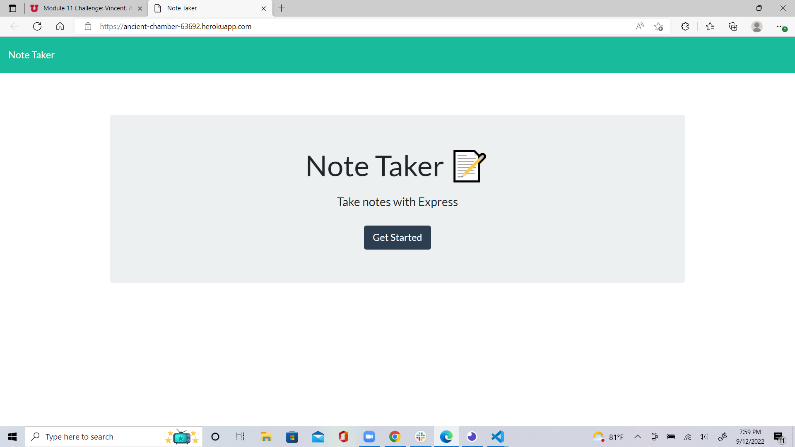

# Note Taker
  ## Description

   Note Taker is an application that can be used to write and save notes. This application will use an Express.js back end and will save and retrieve note data from a JSON file.
  
  ## Table of Contents
  
  - [Installation](#installation)
  - [Usage](#usage)
  - [Credits](#credits)
  - [How to Contribute](#how_to_Contribute)
  - [Tests](#tests)

  ## Installation
  
  Express
  
  ## Usage
  
  it is used by node server.js that opens up the server of the note taker.
  
  ## Credits
  
  Me
  
  ## How to Contribute
  
  fork repository
  
  ## Link to deployed site

  [Note Taker link](https://ancient-chamber-63692.herokuapp.com/)

  ## Screenshot of deployed site

  
  
